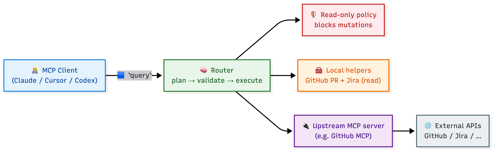

# mcp-lens

## Title

`mcp-lens` is an MCP proxy that exposes a **single tool** to clients: `query`.

You ask in plain language → it plans a few read-only tool calls → executes them → returns structured results.

## Diagram (left → right)



## How to use it

### Install (auto, prints installed absolute path)

- macOS/Linux:

```bash
MCP_LENS_VERSION="${MCP_LENS_VERSION:-v1.0.2}" bash -lc 'curl -fsSL https://raw.githubusercontent.com/golovatskygroup/mcp-lens/main/install.sh | bash'
```

- Windows (PowerShell):

```powershell
$env:MCP_LENS_VERSION = $env:MCP_LENS_VERSION; if (-not $env:MCP_LENS_VERSION) { $env:MCP_LENS_VERSION = "v1.0.2" }; iwr -useb https://raw.githubusercontent.com/golovatskygroup/mcp-lens/main/install.ps1 | iex
```

If you cloned this repo, you can also run `./install.sh` or `./install.ps1`.


### Claude Code (1 command)

```bash
claude mcp add --transport stdio mcp-lens \
  --env OPENROUTER_API_KEY=$OPENROUTER_API_KEY \
  --env MCP_LENS_ROUTER_MODEL=$MCP_LENS_ROUTER_MODEL \
  --env JIRA_BASE_URL=$JIRA_BASE_URL \
  --env JIRA_PAT=$JIRA_PAT \
  -- /ABS/PATH/TO/mcp-lens
```

### Cursor / Codex (1 config snippet)

```json
{
  "mcpServers": {
    "mcp-lens": {
      "command": "/ABS/PATH/TO/mcp-lens",
      "env": {
        "OPENROUTER_API_KEY": "${OPENROUTER_API_KEY}",
        "MCP_LENS_ROUTER_MODEL": "${MCP_LENS_ROUTER_MODEL}",
        "GITHUB_TOKEN": "${GITHUB_TOKEN}",
        "GITHUB_PERSONAL_ACCESS_TOKEN": "${GITHUB_PERSONAL_ACCESS_TOKEN}",
        "JIRA_BASE_URL": "${JIRA_BASE_URL}",
        "JIRA_PAT": "${JIRA_PAT}",
        "CONFLUENCE_BASE_URL": "${CONFLUENCE_BASE_URL}",
        "CONFLUENCE_EMAIL": "${CONFLUENCE_EMAIL}",
        "CONFLUENCE_API_TOKEN": "${CONFLUENCE_API_TOKEN}",
        "GRAFANA_BASE_URL": "${GRAFANA_BASE_URL}",
        "GRAFANA_API_TOKEN": "${GRAFANA_API_TOKEN}",
        "GRAFANA_CF_ACCESS_CLIENT_ID": "${GRAFANA_CF_ACCESS_CLIENT_ID}",
        "GRAFANA_CF_ACCESS_CLIENT_SECRET": "${GRAFANA_CF_ACCESS_CLIENT_SECRET}",
        "GRAFANA_ORG_ID": "${GRAFANA_ORG_ID}"
      }
    }
  }
}
```

### Which env vars enable which tools

- **Router / `query` tool**
  - Requires: `OPENROUTER_API_KEY` + `MCP_LENS_ROUTER_MODEL`
  - Optional tuning: `MCP_LENS_ROUTER_BASE_URL`, `MCP_LENS_ROUTER_TIMEOUT_MS`, `MCP_LENS_ROUTER_MAX_TOKENS_PLAN`, `MCP_LENS_ROUTER_MAX_TOKENS_SUMMARY`
  - Optional output shaping: pass `output` in `query` args (view/include_fields/exclude_fields/max_items/max_depth/redact)

- **GitHub local helpers (PR review / diffs / files / commits / checks)**
  - Env: `GITHUB_TOKEN` (preferred) or `GITHUB_PERSONAL_ACCESS_TOKEN` (fallback)
  - Enables router to successfully execute GitHub read-only helpers (for private repos + higher rate limits)

- **Jira local tools**
  - Env: `JIRA_BASE_URL` + one auth method:
    - DC/Server: `JIRA_PAT` (or `JIRA_BEARER_TOKEN`)
    - Cloud (basic): `JIRA_EMAIL` + `JIRA_API_TOKEN`
    - Cloud (OAuth/3LO): `JIRA_OAUTH_ACCESS_TOKEN` + `JIRA_CLOUD_ID`
  - Enables router to execute Jira read-only calls (issue search/details/comments/transitions/projects)

- **Multi-Jira routing**
  - Env: `JIRA_CLIENTS_JSON` + optional `JIRA_DEFAULT_CLIENT`
  - Lets you target a specific Jira instance by prefixing your request: `jira <client> ...`

- **Confluence local tools**
  - Env: `CONFLUENCE_BASE_URL` + one auth method:
    - Cloud (basic): `CONFLUENCE_EMAIL` + `CONFLUENCE_API_TOKEN`
    - Bearer/PAT: `CONFLUENCE_BEARER_TOKEN` or `CONFLUENCE_PAT`
    - Cloud (OAuth/3LO): `CONFLUENCE_OAUTH_ACCESS_TOKEN` + `CONFLUENCE_CLOUD_ID`
    - DC/Server (basic, if enabled): `CONFLUENCE_USERNAME` + `CONFLUENCE_PASSWORD`
  - Enables router to execute Confluence read-only calls (spaces/pages/CQL search)

- **Multi-Confluence routing**
  - Env: `CONFLUENCE_CLIENTS_JSON` + optional `CONFLUENCE_DEFAULT_CLIENT`
  - Lets you target a specific Confluence instance by prefixing your request: `confluence <client> ...`

- **Grafana local tools**
  - Env: `GRAFANA_BASE_URL` + one auth method:
    - Token (recommended): `GRAFANA_API_TOKEN` (or `GRAFANA_BEARER_TOKEN`)
    - Basic (if enabled): `GRAFANA_USERNAME` + `GRAFANA_PASSWORD`
  - If Grafana is behind Cloudflare Access: `GRAFANA_CF_ACCESS_CLIENT_ID` + `GRAFANA_CF_ACCESS_CLIENT_SECRET` (or `CF_ACCESS_CLIENT_ID` + `CF_ACCESS_CLIENT_SECRET`)
  - Optional: `GRAFANA_ORG_ID` (adds `X-Grafana-Org-Id`)
  - Enables router to execute Grafana read-only calls (dashboards/folders/search/datasources/annotations)

- **Multi-Grafana routing**
  - Env: `GRAFANA_CLIENTS_JSON` + optional `GRAFANA_DEFAULT_CLIENT`
  - Lets you target a specific Grafana instance by prefixing your request: `grafana <client> ...`

- **Upstream MCP server selection**
  - Env: `MCP_LENS_PRESET` (e.g. `github`) or `MCP_LENS_UPSTREAM_*`
  - Changes which upstream MCP server is launched (and therefore which upstream tools exist)

- **HTTP cache (optional, local tools only)**
  - Env: `MCP_LENS_HTTP_CACHE_ENABLED=1`, `MCP_LENS_HTTP_CACHE_TTL_SECONDS`, `MCP_LENS_HTTP_CACHE_MAX_ENTRIES`
  - Caches GET requests (ETag/If-None-Match + TTL) separately per auth headers

- **Artifacts (optional)**
  - Env: `MCP_LENS_ARTIFACT_DIR`, `MCP_LENS_ARTIFACT_INLINE_MAX_BYTES`, `MCP_LENS_ARTIFACT_PREVIEW_BYTES`
  - Large tool results are stored to disk and returned as `artifact://...` references (also exposed via `resources/list` + `resources/read`)

- **Dev mode (opt-in)**
  - Env: `MCP_LENS_DEV_MODE=1`
  - Enables `dev_scaffold_tool` (planner-driven patch + isolated git worktree generator for new local tools; requires git)

## Features

- **One tool for users**: clients see only `query` via `tools/list`
- **Safer by default**: strict **read-only policy** (mutations blocked)
- **Works with big PRs**: chunked diffs + auto-pagination helpers
- **Executor mode**: provide explicit `steps[]` to validate + execute without planning/LLM
- **Upstream-agnostic**: runs any upstream MCP server as a child process (default: GitHub MCP)
- **Jira support included**: read-only Jira calls when auth is configured
- **Confluence support included**: read-only Confluence calls when auth is configured
- **Grafana support included**: read-only Grafana calls when auth is configured

## How it works (technically)

- **Upstream process**: launches the configured upstream MCP server (default: `@modelcontextprotocol/server-github`)
- **Registry**: loads upstream tool schemas at startup (for discovery/routing)
- **Router** (`query`):
  - sends your request + tool catalog to an LLM to produce a short JSON plan
  - validates plan against policy (read-only, allowlist, args must be JSON objects)
  - executes steps locally (helpers) or upstream (if policy allows)
  - optionally summarizes results (`include_answer=true`)

## Codex-friendly workflow

### 1) Plan-only

Use `dry_run=true` to get the tool plan without executing:

```json
{"input":"Review PR https://github.com/org/repo/pull/123","dry_run":true,"format":"json"}
```

### 2) Executor mode (bring-your-own-plan)

Provide `mode=executor` + `steps[]` to validate + execute without calling OpenRouter:

```json
{
  "input": "execute explicit steps",
  "mode": "executor",
  "steps": [
    {"name":"get_pull_request_summary","source":"local","args":{"repo":"org/repo","number":123}},
    {"name":"fetch_complete_pr_diff","source":"local","args":{"repo":"org/repo","number":123}}
  ],
  "include_answer": true
}
```

Optional: set `parallelism>1` and a shared `parallel_group` on steps to run them concurrently (local-only).

### 3) CI failure loop (GitHub Actions)

Typical flow:
- `github_list_workflow_runs` → find run id for a SHA/branch
- `github_list_workflow_jobs` → find failed job id
- `github_download_job_logs` → saves logs as artifact (`artifact://...`)
